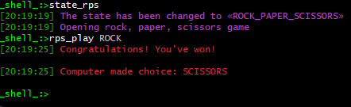

# Spring and spring boot console programs

Yo hey! This repository contains console apps for Spring. I wanted to practice using only Spring, as well as using Spring Boot.

# General Information
 There are two console applications in this repository:
- clear_spring: written using only Spring
- spring_boot: written using Spring Boot with Spring Shell

The projects are completely independent of each other, but because of this, some parts of the code are repeated.

The spring_boot module contains small tests, the clear_spring module doest not.

# How to use it

### For clear_spring and spring_boot

1) Open IntelliJ IDEA: File -> New -> Project from Version Control...
<div> </div> 

2) Enter a link to the repository in the URL field and click Clone
```
URL: https://github.com/tquicklyy/spring_and_spring_boot_console_program
```
<div> </div>

3) Run executable classes in selected module

### For spring_boot with Git and Maven

1) Open a terminal, for example, Git Bash, and clone the project
```
git clone https://github.com/tquicklyy/spring_and_spring_boot_console_program
```

2)  To launch the program go to spring_boot and run:
```
mvn spring-boot:run
```
4) To launch the tests go to spring_boot and run:
```
mvn clean test
```

# Additional Info About apps

## Clear spring

### Program start
<div> </div> 

### Randomizer
<div> </div>

### Calculator
<div> </div>

### Head and Tails
<div> </div>

### Rock, paper, scissors
<div> </div>

### Password generator
<div> </div>

### Getting the length of string
<div> </div>

### Exit program
<div> </div>

## Spring Boot

### Program start
<div> </div> 

### Randomizer
<div> </div>

### Calculator
<div> </div>

### Head and Tails
<div> </div>

### Rock, paper, scissors
<div> </div>

### Password generator
<div> </div>

### Getting the length of string
<div> </div>

### Work with time
<div> </div>

### Exit program
<div> </div>

